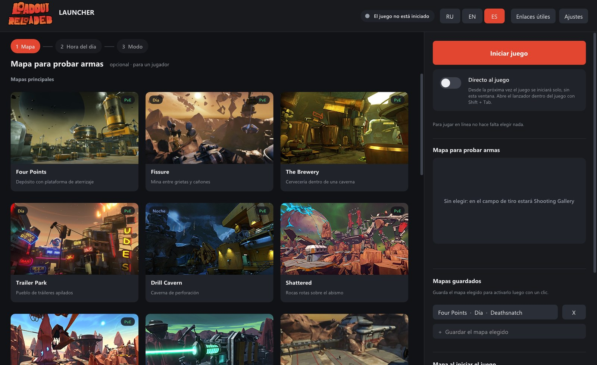

<p align="center">
  
</p>

<h1 align="center">Loadout Reloaded Launcher</h1>

<p align="center">
  <a href="README.md">Русский</a> · <a href="README.en.md">English</a> · <b>Español</b>
</p>

<p align="center">
  <a href="https://github.com/Leshugan/Loadout-Reloaded-Launcher/releases/latest"><b>⬇ Descargar LoadoutLauncher.exe</b></a>
</p>

Mi propio lanzador para el proyecto [Loadout Reloaded](https://gitlab.com/Bedebao/loadout-reloaded), que facilita el trabajo con el juego, el servidor, los mapas y la descarga de los archivos del juego.

Si todavía no has descargado el juego ni has visitado la página del proyecto, simplemente descarga este lanzador: te ofrecerá descargar el juego y, después, todo funcionará sin ninguna configuración.


<p align="center">
  
  
</p>

**Licencia:** haz lo que quieras con el código fuente: forks, mods, lo que sea. La única condición es mencionarme como autor.

---

<details>
<summary>Build · Сборка · Compilación</summary>

Requires mingw-w64 (x86_64 and i686 `g++`). All libraries are in `third_party/`.

```sh
sh build.sh      # → out/LoadoutLauncher.exe
```

Large files in `res/*.llz` are packed with `tools/pack.py` and unpacked by the launcher at run time.

</details>

<details>
<summary>Third-party · Сторонние компоненты · Componentes de terceros</summary>

- [Dear ImGui](https://github.com/ocornut/imgui) — MIT
- [stb_image / stb_image_write](https://github.com/nothings/stb) — MIT / Public Domain
- [MinHook](https://github.com/TsudaKageyu/minhook) — BSD 2-Clause
- [miniz](https://github.com/richgel999/miniz) — MIT
- [Loadout Reloaded](https://gitlab.com/Bedebao/loadout-reloaded) — SSELoadout.dll and the uncensored patch file, AGPL-3.0
- SmartSteamEmu — files in `res/` are distributed as is
- Map images — from the game Loadout and the [Loadout Wiki](https://loadout.fandom.com); Loadout © Edge of Reality

</details>
