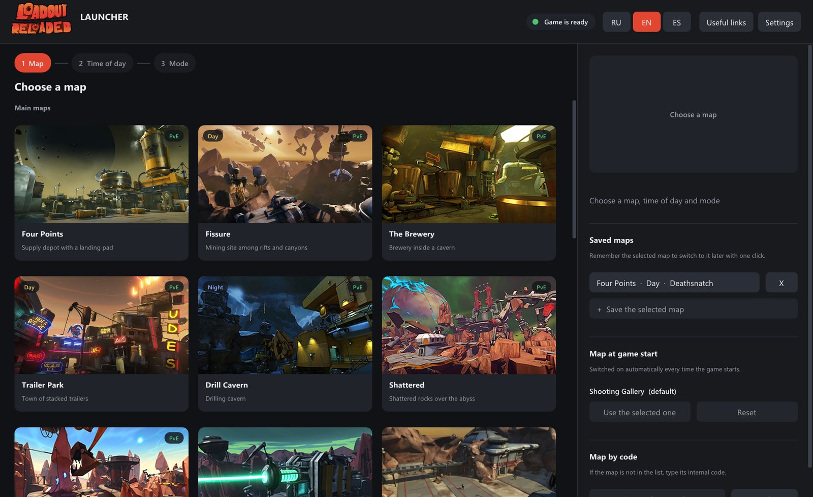
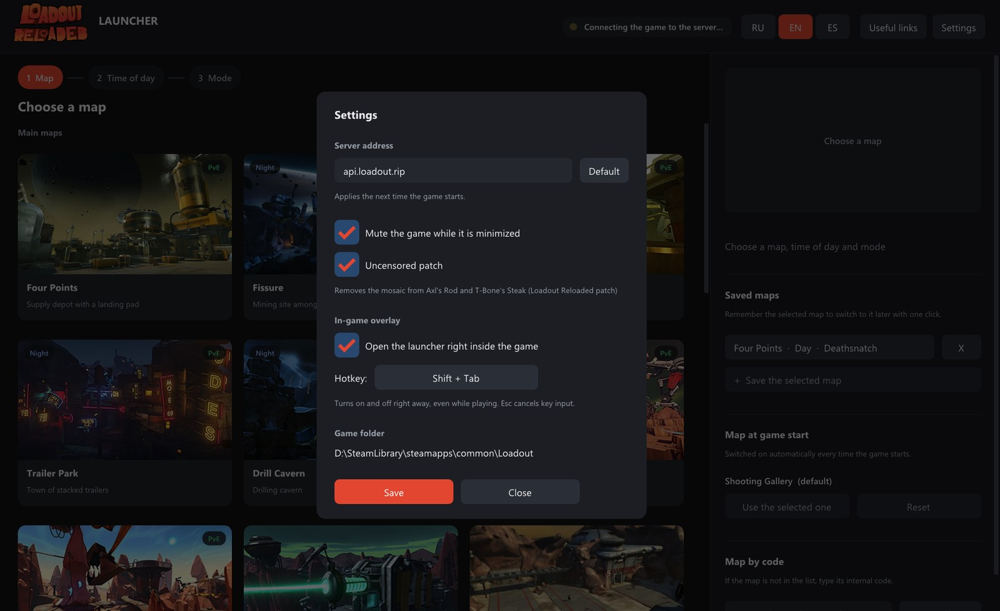
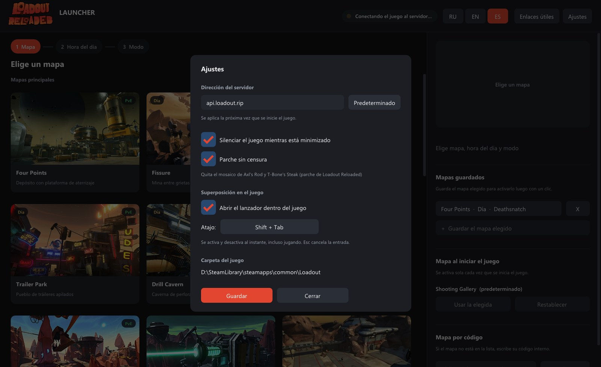

<p align="center">
  
</p>

<h1 align="center">Loadout Reloaded Launcher</h1>

<p align="center">
  <a href="#русский">Русский</a> · <a href="#english">English</a> · <a href="#español">Español</a>
</p>

<p align="center">
  <a href="https://github.com/Leshugan/Loadout-Reloaded-Launcher/releases/latest"><b>⬇ LoadoutLauncher.exe</b></a>
</p>

---

## Русский

Мой авторский лаунчер для проекта [Loadout Reloaded](https://gitlab.com/Bedebao/loadout-reloaded), который упрощает взаимодействие с игрой, с сервером, картами и скачиванием файлов игры.

Если вы ещё не качали игру или не заходили на страницу проекта, можете просто скачать этот лаунчер — вам будет предложено скачать игру, после чего всё будет просто работать без каких-либо настроек.


<p align="center">
  
  
</p>

**Лицензия:** делайте с исходным кодом что хотите — форки, моды и всё остальное. Единственное условие — указывайте меня как автора.

## English

My own launcher for the [Loadout Reloaded](https://gitlab.com/Bedebao/loadout-reloaded) project that makes it easier to work with the game, the server, maps and downloading the game files.

If you haven't downloaded the game yet or haven't visited the project page, you can simply download this launcher — it will offer to download the game, and after that everything will just work with no setup at all.


<p align="center">
  
  
</p>

**License:** do whatever you want with the source code — forks, mods, anything. The only condition is to credit me as the author.

## Español

Mi propio lanzador para el proyecto [Loadout Reloaded](https://gitlab.com/Bedebao/loadout-reloaded), que facilita el trabajo con el juego, el servidor, los mapas y la descarga de los archivos del juego.

Si todavía no has descargado el juego ni has visitado la página del proyecto, simplemente descarga este lanzador: te ofrecerá descargar el juego y, después, todo funcionará sin ninguna configuración.


<p align="center">
  
  
</p>

**Licencia:** haz lo que quieras con el código fuente: forks, mods, lo que sea. La única condición es mencionarme como autor.

---

<details>
<summary>Build · Сборка · Compilación</summary>

Requires mingw-w64 (x86_64 and i686 `g++`). All libraries are in `third_party/`.

```sh
sh build.sh      # → out/LoadoutLauncher.exe
```

Large files in `res/*.llz` are packed with `tools/pack.py` and unpacked by the launcher at run time.

</details>

<details>
<summary>Third-party · Сторонние компоненты · Componentes de terceros</summary>

- [Dear ImGui](https://github.com/ocornut/imgui) — MIT
- [stb_image / stb_image_write](https://github.com/nothings/stb) — MIT / Public Domain
- [MinHook](https://github.com/TsudaKageyu/minhook) — BSD 2-Clause
- [miniz](https://github.com/richgel999/miniz) — MIT
- [Loadout Reloaded](https://gitlab.com/Bedebao/loadout-reloaded) — SSELoadout.dll and the uncensored patch file, AGPL-3.0
- SmartSteamEmu — files in `res/` are distributed as is
- Map images — from the game Loadout and the [Loadout Wiki](https://loadout.fandom.com); Loadout © Edge of Reality

</details>
